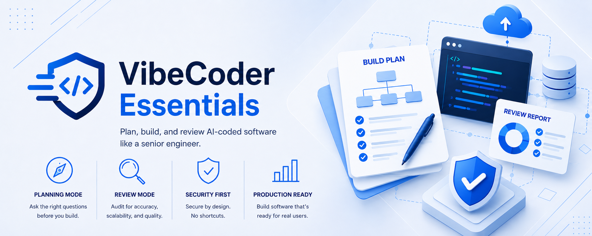

# VibeCoder Essentials

<p align="center">
  
</p>

> Plan, build, and review vibe-coded software like a senior engineer.

[](LICENSE)
[](CHANGELOG.md)
[](skills/vibecoder-essentials/SKILL.md)

**VibeCoder Essentials** is an [Agent Skill](https://docs.anthropic.com/en/docs/claude-code/skills)
that turns your AI coding assistant into a senior software engineer, security
auditor, and systems architect — so the apps you vibe-code don't just *look*
finished, they're actually ready for real users and real data.

It works at **both ends** of the build:

- **Planning Mode** — *before* you build. It asks the critical product, data,
  security, and infrastructure questions a senior engineer would, then hands you
  a concrete **Build Plan** with a readiness verdict.
- **Review Mode** — *after* you build. It audits your repo, code, architecture,
  screenshot, or live deployment for security, scalability, and
  production-readiness, then hands you a **Review** with a final verdict.

---

## Why this exists

AI-assisted development made it trivial to ship something that works on the happy
path. The hard parts — authorization, secrets, multi-tenancy, data modeling,
failure handling, observability, scaling — stay invisible until they fail in
production.

Most vibe-coded apps die from the same wounds:

- An **API key shipped in the frontend** bundle.
- **Authorization checked only in the UI** — the endpoint is wide open.
- **One tenant able to read another tenant's data.**
- A **`500` that leaks a stack trace** to users.
- **No logs** when it breaks at 2am.
- A **synchronous endpoint** that collapses the moment it gets traffic.

VibeCoder Essentials catches these *early* (a sentence to fix) instead of *late*
(an incident to clean up). Its rule number one: **never trust the frontend.**

---

## Quick start (Claude Code)

The fastest way to install. In Claude Code, add this repo as a plugin
marketplace and install the skill:

```text
/plugin marketplace add axelandreyrv-dotcom/vibecoder-essentials
/plugin install vibecoder-essentials@vibecoder-essentials
```

That's it. Now just talk to Claude naturally — the skill activates on planning
and review requests:

```text
Use VibeCoder Essentials to plan this app before building.
```

```text
Use VibeCoder Essentials to review this repo before production.
```

You can also invoke it explicitly by its namespaced name:

```text
/vibecoder-essentials:vibecoder-essentials
```

> The format is `<skill>@<marketplace>`. Both are named `vibecoder-essentials`
> here, which is why the install line reads
> `vibecoder-essentials@vibecoder-essentials`.

---

## What it checks

Across both modes, it reasons about the things that actually make software
production-grade:

- **Security** — server-side authorization, secrets handling, exposed API keys,
  input validation, SQL injection, CORS, rate limiting, CAPTCHA, WAF/DDoS,
  security headers. Grounded in **OWASP Top 10**, **OWASP API Security Top 10**,
  and **CWE**.
- **Architecture** — stateless backends, decoupling, queues, caching,
  idempotency, retries, resilience, high availability, scalability.
- **Data** — schema design, normalization, indexes, migrations, N+1 queries,
  backups, soft deletes, audit logs.
- **Multi-tenancy** — tenant isolation, tenant-aware authorization, caching, and
  background jobs.
- **Operations** — error tracking, structured logging, alerts, health checks,
  CI/CD, environments, secret management.
- **Testing** — unit, integration, E2E, API, **authorization**, **tenant
  isolation**, webhooks, payments.
- **Platform** — Windows/macOS installability, code signing, auto-updates.

---

## Installation

The skill lives at [`skills/vibecoder-essentials/SKILL.md`](skills/vibecoder-essentials/SKILL.md).
Pick your tool below. **Claude Code users: use the
[Quick start](#quick-start-claude-code) plugin install above** — the sections
here cover every other tool, plus a manual fallback.

### Claude.ai (web / desktop)

Claude.ai custom skills are installed by **ZIP upload** (there is no plugin
marketplace on Claude.ai). Skills are available on paid plans via
**Settings → Capabilities → Skills**.

1. Download or clone this repo.
2. Zip the skill folder so `SKILL.md` is at the **root** of the zip:
   ```bash
   cd skills/vibecoder-essentials
   zip -r vibecoder-essentials.zip SKILL.md references/
   ```
3. In Claude.ai, open **Settings → Capabilities → Skills** (Pro/Max/Team/Enterprise).
4. Click **Upload skill** and select `vibecoder-essentials.zip`.
5. Start a new chat and say *"Use VibeCoder Essentials to plan this app"* or
   *"Use VibeCoder Essentials to review my repo."* Claude loads the skill
   automatically.

### Codex

Codex supports native **Agent Skills**, so you can install VibeCoder Essentials
as a reusable skill — and optionally keep `AGENTS.md` for project-level guidance.

**Option A — install as an Agent Skill (recommended):** drop the skill folder
into Codex's skills directory so it's discovered automatically.

```bash
# Repository-level (only this project)
mkdir -p .agents/skills
cp -r skills/vibecoder-essentials .agents/skills/
#   → .agents/skills/vibecoder-essentials/SKILL.md

# User-level (available in every project)
mkdir -p ~/.agents/skills
cp -r skills/vibecoder-essentials ~/.agents/skills/
#   → ~/.agents/skills/vibecoder-essentials/SKILL.md
```

**Option B — project guidance via `AGENTS.md` (optional):** this repo ships an
`AGENTS.md` at the root that tells Codex to apply VibeCoder Essentials in
Planning or Review Mode and points it to
`skills/vibecoder-essentials/SKILL.md` and the `references/` files. Copy it into
your project if you want that behavior baked into the repo:

```bash
cp AGENTS.md /path/to/your/project/
```

Either way, ask Codex to *plan* or *review* an app — it follows the skill's
modes and output templates.

### GitHub Copilot / VS Code

Copilot Chat respects repo-level custom instructions.

1. Copy the skill into your repo:
   ```bash
   cp -r skills/vibecoder-essentials .
   ```
2. Copy the ready-made instructions file from this repo:
   ```bash
   mkdir -p .github
   cp .github/copilot-instructions.md /path/to/your/project/.github/
   ```
   Or create `.github/copilot-instructions.md` manually — see the
   [example in this repo](.github/copilot-instructions.md) for the full content.
3. Reload VS Code. In Copilot Chat, ask to plan or review your app, and reference
   the files with `#file` if needed.

### Manual install (Claude Code, without the marketplace)

If you'd rather not use the plugin marketplace, you can drop the skill straight
into Claude Code's skills directory.

**User-level (available in every project):**

```bash
# macOS / Linux
mkdir -p ~/.claude/skills
cp -r skills/vibecoder-essentials ~/.claude/skills/
```

```powershell
# Windows (PowerShell)
New-Item -ItemType Directory -Force "$env:USERPROFILE\.claude\skills"
Copy-Item -Recurse skills\vibecoder-essentials "$env:USERPROFILE\.claude\skills\"
```

**Project-level (only this repo):**

```bash
mkdir -p .claude/skills
cp -r skills/vibecoder-essentials .claude/skills/
```

Start a session (or run `/doctor`) to confirm the skill is detected. It triggers
automatically on planning/review requests, or you can ask for it by name.

> **Note:** Native Agent Skills and the plugin marketplace are Claude features.
> On Codex and Copilot, the same content is applied via `AGENTS.md` /
> `copilot-instructions.md`, which is why this repo ships both.

---

## Usage

Just talk to your assistant naturally. The skill detects the mode for you.

**Planning:**

> "I want to build a SaaS app where teams track their freelance invoices. Use
> VibeCoder Essentials to plan it before I start coding."

**Reviewing:**

> "Here's my repo. Use VibeCoder Essentials to check whether it's safe to deploy
> to production."

If it's ambiguous, the skill asks exactly one question: *"Are we planning this
app before building it, or reviewing an app that already exists?"*

### Try these prompts

**Planning Mode**

> "I'm about to vibe-code a habit-tracking web app with a friend. It'll have
> accounts, daily check-ins, and a streak leaderboard. Walk me through planning
> it like a senior engineer before we write any code."

**Review Mode**

> "I built a Next.js app that calls the OpenAI API from the client and stores
> notes in Supabase. Here's the repo — review it for security and
> production-readiness before I launch."

**SaaS multi-tenant review**

> "Review my multi-tenant B2B dashboard (Node + Postgres + Prisma). Multiple
> companies share one database with a `tenant_id` column. I'm worried about
> tenant isolation, authorization, and whether it'll scale. Audit it."

### See example outputs

- [examples/sample-build-plan.md](examples/sample-build-plan.md) — a full
  Planning Mode Build Plan for a B2B SaaS app, before any code is written.
- [examples/sample-review.md](examples/sample-review.md) — a full Review Mode
  audit of an existing Next.js + Supabase + OpenAI app.

---

## Repository structure

```text
vibecoder-essentials/
├── README.md                  # You are here
├── SECURITY.md                # Security policy & scope
├── CONTRIBUTING.md            # How to contribute
├── CHANGELOG.md               # Version history
├── AGENTS.md                  # Instructions for Codex & other agents
├── LICENSE                    # MIT
├── .claude-plugin/
│   └── marketplace.json       # Claude Code plugin marketplace manifest
├── .github/
│   └── copilot-instructions.md  # Copilot / VS Code custom instructions
├── examples/
│   ├── sample-build-plan.md   # Example Planning Mode output
│   └── sample-review.md       # Example Review Mode output
└── skills/
    └── vibecoder-essentials/
        ├── SKILL.md           # The skill (modes, attitude, output contracts)
        └── references/
            ├── planning-mode.md      # Planning question bank
            ├── review-mode.md        # Review audit checklist
            ├── security-baseline.md  # OWASP / CWE baseline
            └── output-templates.md   # Build Plan & Review templates
```

---

## Compatibility

| Platform | Mechanism | Status |
|---|---|---|
| Claude Code | Plugin marketplace (`/plugin install`) or manual `~/.claude/skills` install | ✅ |
| Claude.ai | Custom skill ZIP upload | ✅ |
| Codex | Native Agent Skill via `.agents/skills` plus optional `AGENTS.md` | ✅ |
| GitHub Copilot / VS Code | `copilot-instructions.md` plus skill files | ✅ |

---

## Contributing

Issues and PRs welcome — see [CONTRIBUTING.md](CONTRIBUTING.md). Security policy
is in [SECURITY.md](SECURITY.md).

## License

[MIT](LICENSE) © VibeCoder Essentials contributors.

---

> 🇪🇸 **Nota:** VibeCoder Essentials funciona en español e inglés. Puedes pedirle
> *"Usa VibeCoder Essentials para planear esta app antes de construirla"* o
> *"Usa VibeCoder Essentials para revisar este repo antes de producción"* y se
> activará igual. La documentación principal está en inglés.
